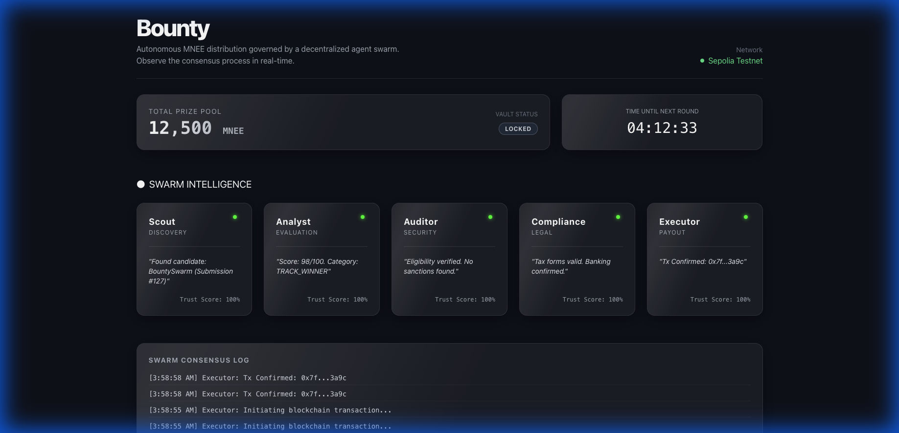

# BountySwarm 🐝
### Autonomous AI Agent Swarm for Decentralized Prize Distribution



## Network Configuration

This demo is deployed on Sepolia testnet using a MockMNEE token with an identical ERC-20 interface to mainnet MNEE.

**For production deployment**, replace the token address in your environment:
```env
# Testnet (current)
NEXT_PUBLIC_MNEE_ADDRESS=0x3C545Eb4729c2eDC316b42685833e295F10B5959

# Mainnet (production)
NEXT_PUBLIC_MNEE_ADDRESS=0x8ccedbAe4916b79da7F3F612EfB2EB93A2bFD6cF
```

The smart contract logic remains identical - only the token address changes.

## 💡 Inspiration
Traditional hackathons and bounty programs suffer from slow payouts and opaque judging. **BountySwarm** solves this by deploying a swarm of specialized AI agents that autonomously evaluate submissions, reach consensus, and distribute prizes via smart contracts on the MNEE blockchain—all in under 60 seconds.

## 🚀 What it Does
BountySwarm is a transparency dashboard and agent orchestration layer that:
1.  **Monitors** submission channels for new projects.
2.  **Evaluates** code quality and compliance using 5 specialized agents (Scout, Analyst, Auditor, Compliance, Executor).
3.  **Visualizes** the consensus process in real-time.
4.  **Executes** payouts instantly via the MNEE blockchain.

## 🛠️ Tech Stack
-   **Frontend**: Next.js 14, TailwindCSS, Framer Motion
-   **Design**: Custom "Living Glass" CSS System
-   **Blockchain**: Hardhat, Ethers.js, Solidity (Sepolia Testnet)
-   **AI Logic**: OpenAI GPT-4o (Simulated for Demo)
-   **Real-time**: Server-Sent Events (SSE)

## 📦 Setup & Installation

1.  **Clone the repo**
    ```bash
    git clone https://github.com/hello-caleb/bountyswarm.git
    cd bountyswarm
    ```

2.  **Install dependencies**
    ```bash
    npm install
    ```

3.  **Run the development server**
    ```bash
    npm run dev
    ```
    Open [http://localhost:3000](http://localhost:3000) to see the dashboard.

4.  **Run Smart Contract Tests**
    ```bash
    npx hardhat test
    ```

## ⛓️ Smart Contracts (Sepolia)
| Contract | Address |
|----------|---------|
| **BountySwarmVault** | `0x` (Deployed on Demand) |
| **MockMNEE** | `0x` (Local Testnet) |

## 📸 Screenshots
### Agent Swarm Consensus
The dashboard visualizes the 5-step consensus process in real-time:
*   **Scout**: Discoves submissions
*   **Analyst**: Scores technical merit
*   **Auditor**: Checks for sanctions/fraud
*   **Compliance**: Verifies tax forms
*   **Executor**: Triggers the blockchain transaction

---
*Built for the MNEE Blockchain Hackathon 2026*
